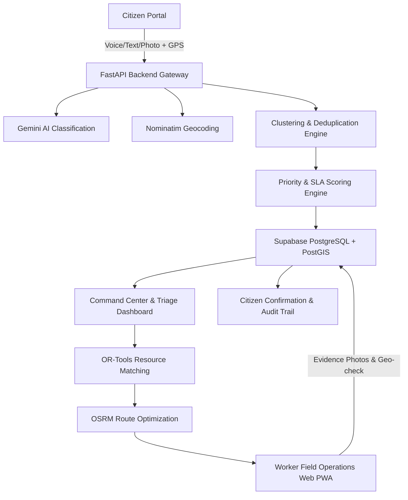

# Janseva AI (जनसेवा AI)
> **From citizen voice to civic action.**

Janseva AI is a production-grade, AI-powered municipal grievance and field operations platform designed for Indian urban local bodies and municipal corporations.

---

## 🏛️ System Architecture



### Core Features

1. **Citizen Grievance Submission & Multi-Modal Input**
   - Multilingual voice support (Web Speech API recognition for Hindi, Marathi, Gujarati, Bengali, Tamil, Telugu, Kannada, English)
   - Real-time GPS auto-detection with OpenStreetMap Nominatim reverse geocoding
   - Complaint deduplication & incident clustering within dynamic spatial-temporal radius
   - Live complaint tracker with timeline, status history, and citizen reopen loop

2. **AI & Intelligence Engine**
   - Google Gemini 2.5 Flash pipeline for automated categorization, hazard detection, and priority scoring
   - Mathematical priority scoring model weighing severity, population impact, hazard risk, vulnerability, and duplicate volume
   - Dynamic SLA calculation with automatic escalation timers

3. **Smart Workforce & Operations Assignment**
   - Skill-based and department-based matching
   - OR-Tools constraint satisfaction for optimal team & equipment allocation
   - OSRM route calculation for field dispatch and ETA estimation

4. **Executive & Command Center Dashboard**
   - Real-time incident triage and map clustering
   - Ward-by-ward analytics and resolution metrics computed directly from database
   - Full audit logging with IP, user agent, and timestamp tracking

---

## 🚀 Quick Start

### Prerequisites
- Node.js 18+ (Node 24 tested)
- Python 3.11+
- Supabase project (PostgreSQL + PostGIS)
- Google Gemini API Key

### Backend Setup
```bash
cd backend
python -m venv venv
# Windows:
.\venv\Scripts\activate
# Linux/macOS:
source venv/bin/activate

pip install -r requirements.txt
cp ../.env.example .env
# Edit .env with your SUPABASE_URL, SUPABASE_KEY, and GEMINI_API_KEY

# Run database migration in Supabase SQL editor:
# backend/migrations/001_core_schema.sql

# Start development server
uvicorn app.main:app --reload --port 8000
```

Backend docs available at: `http://localhost:8000/docs`

### Frontend Setup
```bash
cd frontend
npm install
npm run dev
```

Frontend application available at: `http://localhost:3000`

---

## 🔒 Security & RBAC

| Role | Access Level |
|---|---|
| `CITIZEN` | Submit, track, confirm, or reopen own complaints |
| `WORKER` | View assigned tasks, update operational status, upload completion evidence |
| `SUPERVISOR` | Triage ward incidents, approve worker assignments, manage field teams |
| `ADMIN` | Municipal management, department & equipment CRUD, analytics, audit logs |

---

## 📄 License
Apache 2.0. Built for civic empowerment and public service excellence.
